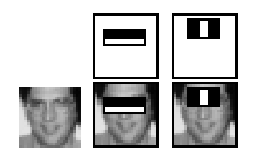
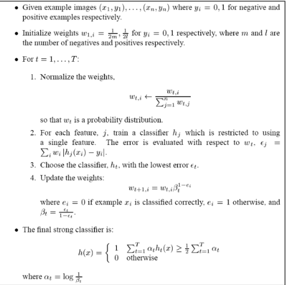
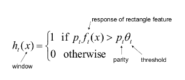
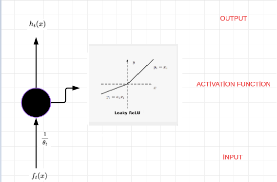
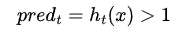
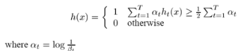

##  INTRO

This project aim to implement an ensamble (attentional cascade) of face detector models (strong learners) 
each of which is composed by a set of weak learners. This project is based on the Viola and 
Jones paper for face detection (2001). All the code used to generate this model can be found in the directory src, more
specifically:   

<body>
    <h2>Project architecture</h2>
    <ul>
        <li> src/learners: it's present the implementation of a weak learner and a strong learner</li>
        <li>src/haar_features: you can find how the haar features are extracted </li>
        <li>
            src/image_processing: you can find three different file:
            <ul>
                <li>/preprocessing: (resizing, normalization, to grey scale)</li>
                <li>/sliding_window: class used to slide a window on an image</li>
                <li>/postprocessing: (not done yet) will be used to remove the additional squares (non-maximal suppression)</li>
            </ul>
        </li>
        <li> src/training: it's present the implementation of Adaboost</li>  
        <li> src/utility: it's present some implementations to store/retrieve the models/dataset and 
set up the desired training</li>  
    </ul>
</body>

## FEATURES EXTRACTION

This model use the so-called Haar features, a primitive technique which use a rectangle to compute a 
real value (feature). More specifically an haar feature is just a rectangle placed in a certain 
region of the image which is splitted in two parts. One part is black the other one is white, these
two subsets of pixels gets subtracted and returned as a feature   

## DATASET

Given the nature of this model, which is based on a sliding window approach, the images gathered for the 
dataset must have been of the same size of the sliding window. Thus each image has size 24x24, this model
was trained with 5000 positive samples (faces) and 5000 negative samples (others).  
Furthermore in order to improve the number of positive samples in the dataset I generated mirror images 
of the faces. 

## ADABOOST TRAINING

The training algorithm (Adaboost), receives a real number as input and return a strong learner as output.
The real value in input represents the number of era for which we want to execute our algorithm. Before starting
the process all the possible haar features get extracted (~160.000) from each image in the training set.
At each round of boosting ~160.000 weak learners are trained with the dataset using just one specific feature, at 
the end of the round the weak learner with the best accuracy gets chosen and stored in a list. After choosing
the best weak learner the weights related to the dataset are updated. More specifically if a sample is classified 
correctly by the previous best weak learner then its relative weights is lowered. This thing is made with the assumption
that the next best weak learner at the t + 1 era will focus on the errors made by the previous one at the t era.   

# WEAK LEARNER

A weak learner according to viola and jones is just an entity which should just learn two parameters:  
a) the parity   
b) the threshold

In my case I built a weak learner as a neural network with just one weight and one neuron. The input is the 
assigned feature and the ouput is a real number.   

The prediction method of a weak learner is a simple boolean control:   

## STRONG LEARNER 

As shown above a strong learner is just a linear combination of weak learners:   
   

This is why each model weight is proportional to its error,  because we multiply each weak learner with its 
inverted error. Furthermore it’s worth to say that the final decision is simply saying:

	I want at least half of my classifier to return positive, if so than I return 1 otherwise 0

Another important thing to focus is that at each round (era) we are choosing the weak learner with the smallest error rate. 
This means that the weak classifier was assigned with maybe a good feature to classify the dataset. So at each round 
(era) the best feature will be used. 

## ATTENTIONAL CASCADE

## ATTENTIONAL CASCADE TRAINING

Now my concerns are that in order to build a good pipeline of strong learners you can't just run adaboost n times with the 
same dataset. You need to handle the quality of the false positive as you go deeper in the pipeline. You should at each
layer collect all the false positives and add them for the training of the next layer
 
